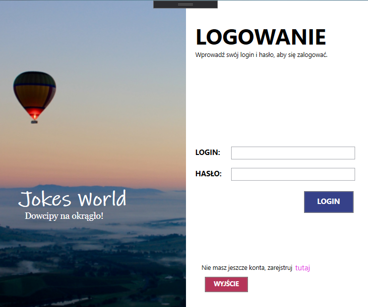
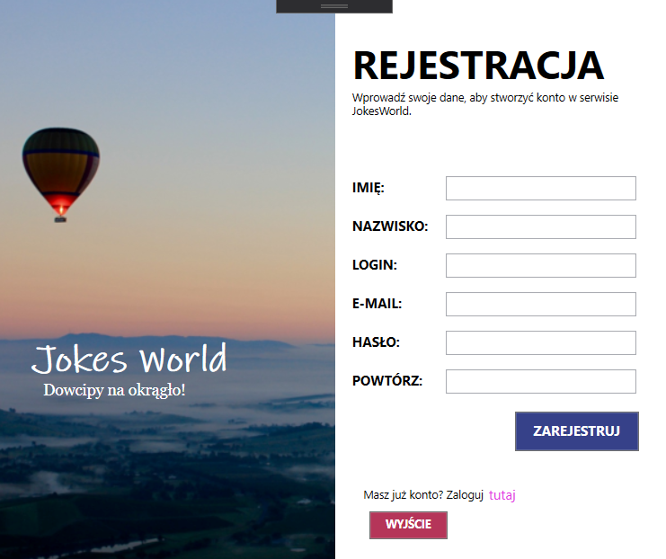
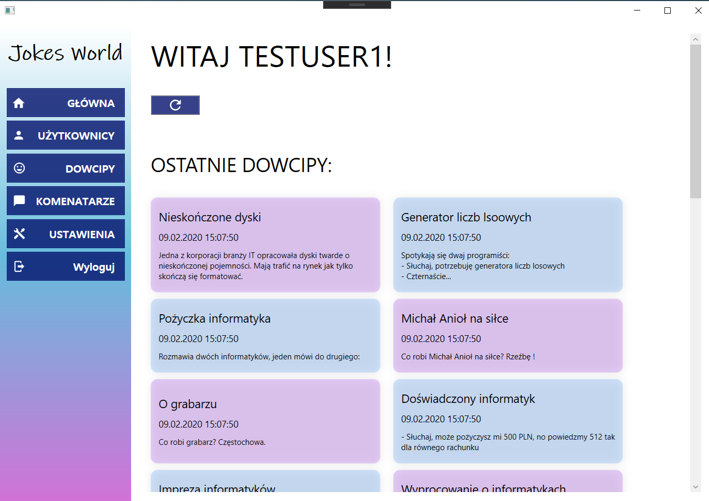
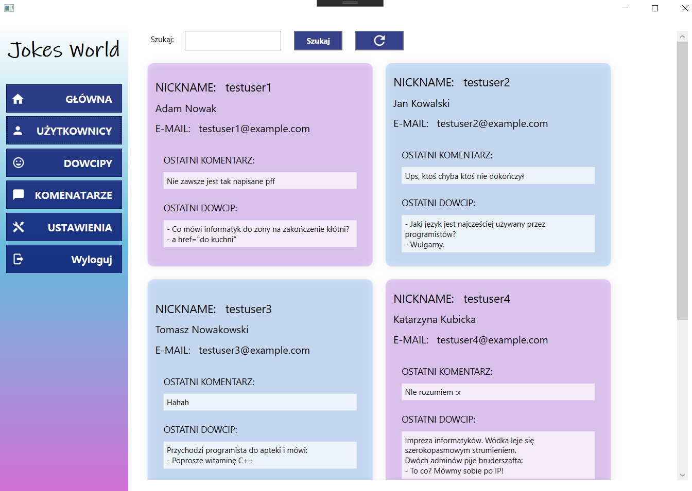
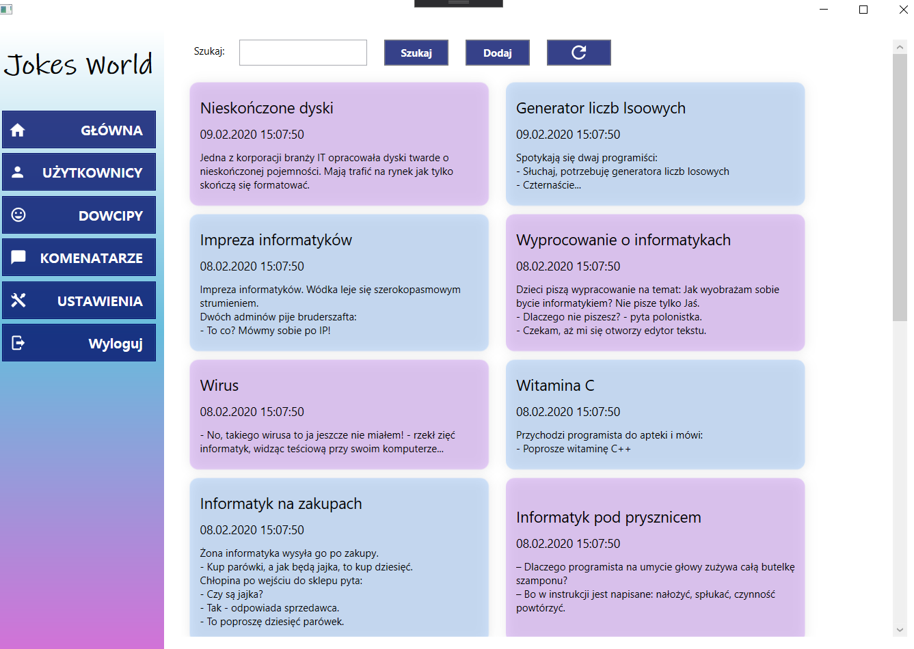
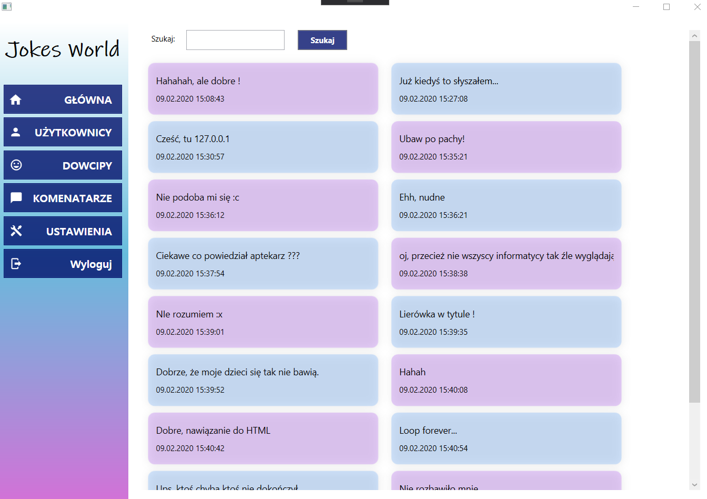
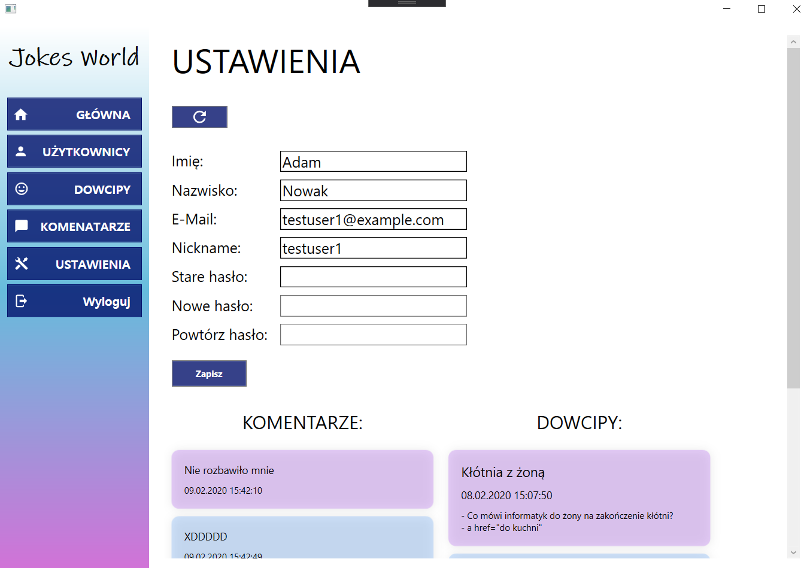
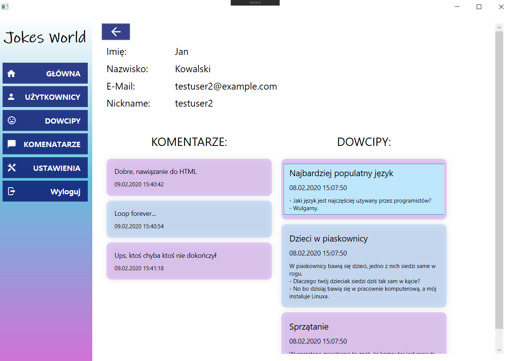
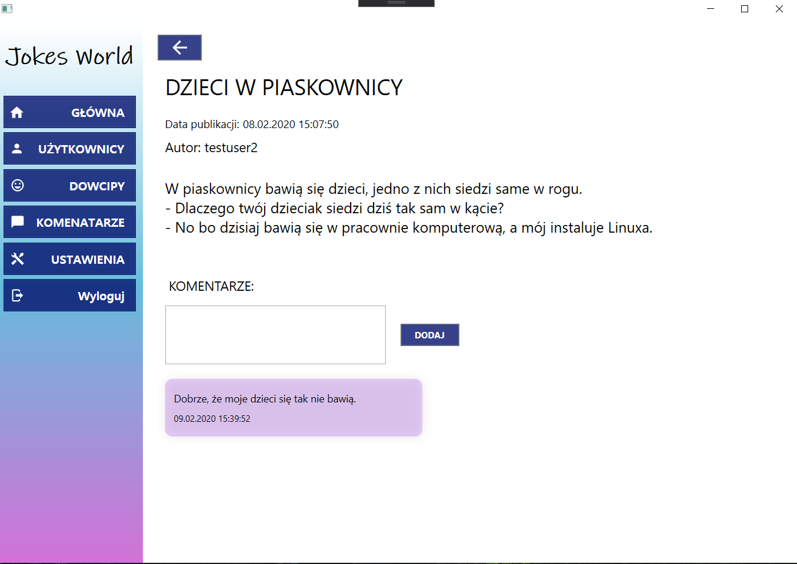
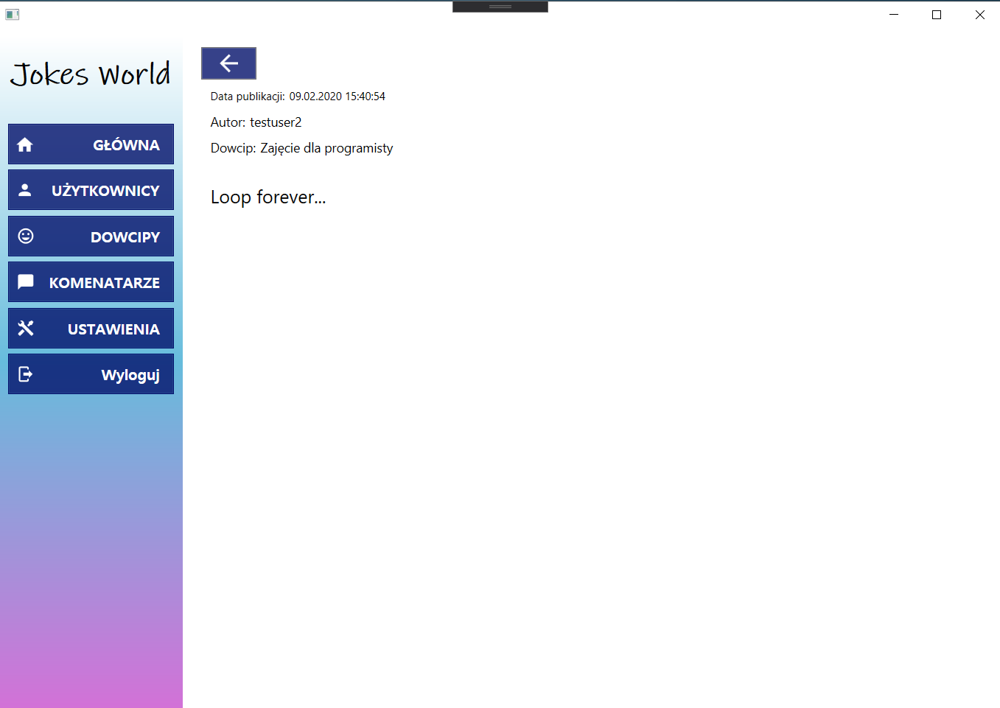

# JokesWorld
RestAPI WCF Windows service with jokes and WPF client's application. Users can create account, add jokes, add comments, edit their data.

---

### To run server as windows service:	

1. Publish your server app with: ```dotnet publish --configuration Release```

2. After publish remember to copy your database file from project directory to publish directory.

3. Create service: ```sc create [ServiceName] binPath= "path\To\your\publish\folder\Server.exe"``` ( space after binPath is important)

4. Start your service ```sc start [ServiceName]```

5. To stop your service use: ```sc stop [ServiceName]```

6. To delete your service use: ```sc delete [ServiceName]```

   #### There is a bit different URL

   You have to change ServerURL for correct one in client's application AppSettings.

   * for DEBUG mode: ```url: https://localhost:44377/jokeserver/api/users```

   * for Windows Service mode: ```url:http//localhost:5000/api/users```

---


### Login Screen:



---


### Register Screen:



---


### Home Screen:



---


### Users Screen:



---


### Jokes Screen:



---


### Comments Screen:



---


### Settings Screen:



---


### Single User Screen:



---


### Single Joke Screen:



---


### Single Comment Screen:

